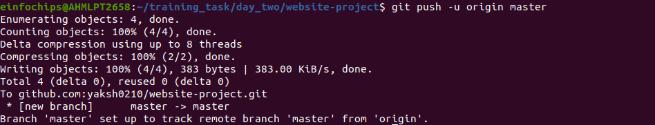

# Objective:

#### You will work on a project involving a simple website. You will learn and practice various Git concepts including branching, merging, handling merge conflicts, rebasing, pulling, versioning, and rolling back changes. This project is designed to be completed in 1 hour.

+ Install Git: Ensure Git is installed on your system. 

```bash 
sudo apt-get update
```
```bash
Sudo apt install git 
```


+ Verify with 

```bash
git --version
```
### Output

-------------------------------------------


-------------------------------------------


+ Set Up Git: 
    
+ Configure your Git username and email: 

```bash
git config --global user.name "Your Name"
```
```bash
git config --global user.email "your email@example.com"
```


## Project 1: Website-project

#### Step 1: Create a GitHub Repository:

+ Go to GitHub and create a new repository named "website-project".

#### Step 2: Clone the repository to your local machine:

```bash
git clone https://github.com/your-username/website-project.git
```

### Output
-------------------------------------------


-------------------------------------------


#### step 3: Initialize the Project

+ Navigate to the project directory:

```bash
cd website-project
```

#### step 4: Create initial project structure:

```bash
mkdir src

touch src/index.html

echo "<!DOCTYPE html><html><head><title>My Website</title></head><body><h1>Welcome to my website!</h1></body></html>" > src/index.html
```

#### step 5 : Commit and push the initial project structure:

```bash
git add .

git commit -m "Initial commit: Added project structure and index.html"

git push origin main
```

### Output

---


---

### Exercise 1: Branching and Basic Operations

+ Create a New Branch:

```bash
git checkout -b feature/add-about-page
```
+ Add a New Page
+ Create about.html

```bash
touch src/about.html

echo "<!DOCTYPE html><html><head><title>About Us</title></head><body><h1>About Us</h1></body></html>" > src/about.html
```
+ Commit and push changes

```bash
git add src/about.html

git commit -m "Added about page"

git push origin feature/add-about-page
```
### Output: 

---


---

---


---

---


---

### Exercise 2: Merging and Handling Merge Conflicts

+ Create Another Branch

```bash
git checkout main

git checkout -b feature/update-homepage
```
+ Update the Homepage

+ Modify index.html

```bash
echo "<p>Updated homepage content</p>" >> src/index.html
```

+ Commit and push changes:

```bash
git add src/index.html

git commit -m "Updated homepage content"

git push origin feature/update-homepage
```

+ Create a Merge Conflict

+ Modify index.html on the feature/add-about-page branch

```bash
git checkout feature/add-about-page

echo "<p>Conflict content</p>" >> src/index.html

git add src/index.html

git commit -m "Added conflicting content to homepage"

git push origin feature/add-about-page
```

+ Merge and Resolve Conflict

+ Attempt to merge feature/add-about-page into main

```bash
git checkout main

git merge feature/add-about-page
```

+ Resolve the conflict in src/index.html, then

```bash
git add src/index.html

git commit -m "Resolved merge conflict in homepage"

git push origin main
```


### Output 

---


---

---


---


### Exercise 3: Rebasing

+ Rebase a Branch:
+ Rebase feature/update-homepage onto main

```bash
git checkout feature/update-homepage

git rebase main
```


+ Resolve any conflicts that arise during rebase.

+ Push the Rebased Branch:

```bash
git push -f origin feature/update-homepage
```

---


---

### Exercise 4: Pulling and Collaboration

+ Pull Changes from Remote

+ Ensure the main branch is up-to-date

```bash
git checkout main

git pull origin main
```

+ Simulate a Collaborator's Change: Make a change on GitHub directly (e.g., edit index.html).

+ Pull Collaborator's Changes:
+ Pull the changes made by the collaborator:

```bash
git pull origin main
```


### Exercise 5: Versioning and Rollback

+ Tagging a Version:

+ Tag the current commit as v1.0:

```bash
git tag -a v1.0 -m "Version 1.0: Initial release"

git push origin v1.0
```

+ Make a Change that Needs Reversion:
Modify index.html:
```bash
echo "<p>Incorrect update</p>" >> src/index.html

git add src/index.html

git commit -m "Incorrect update"

git push origin main
```

+ Revert to a Previous Version:
+ Use git revert to undo the last commit:

```bash
git revert HEAD

git push origin main
```

---


---


+ Alternatively, reset to a specific commit (use with caution):

```bash
git reset --hard v1.0

git push -f origin main
```


### Extra Activities (10 minutes)

+ Stashing Changes:
+ Make some local changes without committing:
```bash
echo "<p>Uncommitted changes</p>" >> src/index.html
``` 
+ Stash the changes:

```bash
git stash
```        

+ Apply the stashed changes:
```bash
git stash apply
```       
    
+ Viewing Commit History:
+ Use git log to view commit history:

```bash
git log --oneline
```        
    
+ Cherry-Picking Commits:
+ Create a new branch and cherry-pick a commit from another branch:

```bash
git checkout -b feature/cherry-pick
git cherry-pick <commit-hash>
git push origin feature/cherry-pick
```


+ Interactive Rebase:
+ Use interactive rebase to squash commits:

```bash
git checkout main
git rebase -i HEAD~3
```

### Output

---


---
